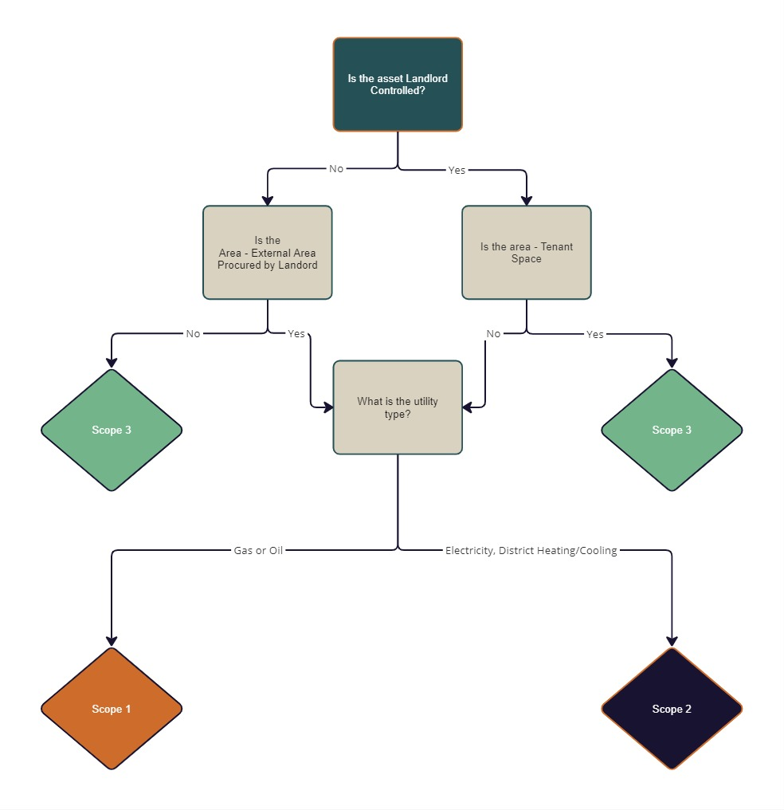
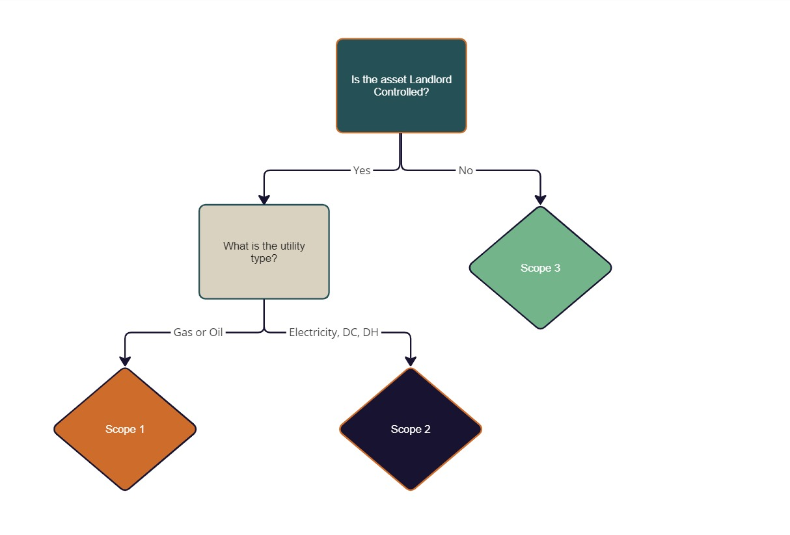

# Carbon Scopes
 

## Scope Allocation

There are 3 scopes to allocate Carbon into. Broadly speaking
<ul>
    <li>Scope 1 includes landlord gas & oil related emissions.</li>
    <li>Scope 2 includes landlord electricity, DH & Dc related emissions.</li>
    <li>Scope 3 relates to emissions from tenant energy usage</li>
</ul>

 

## Allocation Diagram

A true breakdown of these scopes with all scenarios covered comes from the EVORA GHG Accounting House View, a diagram built from this is below

## Allocation Table

This is the allocation of scopes in a tabular format.

| GRESB Management Status of asset | Procured By | Area Served | Utility | Scope |
| --- | --- | --- | --- | --- |
| Directly Managed (Landlord controlled) | N/A | <b>Occupied</b> Tenant Space | Any | 3 |
|Directly Managed | N/A |Any <b>non-occupied</b> Tenant Space | Gas or Oil | 1 |
|Directly Managed|N/A|Any <b>non-occupied</b> Tenant Space| Electricity, DH or DC|2|
|Indirectly Managed (Tenant Controlled)| Tenant| Any non-External Area| Any|3|
|Indirectly Managed| Landlord|External Area| Gas or Oil|1|
|Indirectly Managed| Landlord|External Area| Electricity, DH or DC|2|

 

## Area Gap Allocation (Coverage)

Gaps are calculated if meters do not cover the whol building. A precautionary approach is taken for GHG reporting and for landlord controlled area gaps, it should be assumed that the landlord is responsible for the consumption and therefore the emissions shall be scope 1 or 2 depending on the utility type.

|GRESB Management Status|Utility Type|Scope|
|---|---|---|
|Directly Managed|Gas or Oil|1|
|Directly Managed|Electricity, DH or DC|2|
|Indirectly Managed|Any|3|